# 					Tiger 1.5 to Huawei

## 简介

​	Tiger 1.5 to Huawei 是一个集成了Tiger 1.5 几何处理模块、自动网格修复生成模块、尺寸场生成模块、重网格划分模块、体网格生成模块的C++几何处理体网格生成程序。它只需在Linux环境下借助CMake进行项目构建编译后便可在终端通过输入命令的方式进行使用。根据在命令行输入的命令不同，程序可以以**直接运行**或**调试运行**两种模式运行。

## 几何处理模块

### 功能

​	将几何模型或背景网格处理为程序所要求的背景网格

### 输入输出

 * 输入：
   * STP或IGS模型
   
     或
   
   * STL背景网格
   
 * 输出：
   * STL背景网格

### API

* 模块输入为模型时：

  1. TiGER::Read_Model
     
     ```cpp
     void Read_Model(const std::string& filename,
                        const readModelParameters &args,
  	                   TIGER::Geometry& geometry);
  	```
  	
  	* 输入：
  	  * filename：要处理的模型名
  	  * args：几何处理参数
  	* 输出：
  	  * geometry：处理后的几何模型
  	* 返回：
  	  * 无
  	* 功能：
  	  * 将几何模型`filename`依据几何处理参数`args`处理为几何模型`geometry`
  	
   2. TiGER::CAD_Tessellation

      ```cpp
      void CAD_Tessellation(const TiGER::Geometry& geometry,
                           const TiGER::generateStlParameters& arg_stl,
                           TiGER::SurfaceMesh& surfaceOut);
      ```

      * 输入：
        * geometry：处理后的几何模型
        * arg_stl：背景网格处理参数
      * 输出：
        * surfaceOut：输出的背景网格
      * 返回
      	* 无
      * 功能：
        * 将几何模型`geometry`依据背景网格处理参数`arg_stl`处理为背景网格`surfaceOut`

* 模块输入为背景网格时：

  1. TiGER::MESHIO::readVTK
  
     ```cpp
     int readVTK(const std::string& filename,
                 const std::string& mark_pattern,
                 Mesh& mesh);
     ```
     
     * 输入：
       * filename：要处理的模型名
       * mark_pattern：写入vtk文件的属性名称
	   * 输出：
       * mesh：存储网格信息
     * 返回值：
       * 1：函数成功完成所有操作
       * 0：输入文件格式有问题
       * -1：无法打开输入文件
     * 功能：
       * 读取一个 VTK 文件`filename`，并将其中的几何和拓扑数据解析并存储到一个 `Mesh` 对象中
     
   2. TiGER::matrix_to_list<>
  
         ```cpp
         template <int dim, typename DerivedM>
         //dim = 1
         void matrix_to_list(const Eigen::DenseBase<DerivedM>& M,
         					std::vector<typename DerivedM::Scalar>& V);
      //dim >1
      void matrix_to_list(const Eigen::DenseBase<DerivedM>& M,
          				std::vector<std::array<typename DerivedM::Scalar, dim>>& V);
      ```
      
      *  输入：
        * M：输入的 Eigen 矩阵，该矩阵类型 `DerivedM` 是派生自 `Eigen::DenseBase` 的具体类型，该矩阵的列数应等于模板参数 `dim`
      
      * 输出：
        * V：输出的向量，类型为 `DerivedM::Scalar`
      
      * 返回值：
        * 无
      
      * 功能：
        * 将输入的 Eigen 矩阵 `M` 转换为一个包含定长数组的向量 `V`

### 效果演示


## 自动网格修复生成模块

### 概述

​	本模块针对几何中可能出现的法向错误、穿插、狭缝、贴合问题，通过四面体化方法自动修复几何，并生成高质量的曲面网格。其核心思想是一个有效的四面体网格的表面一定是一个有效的曲面网格。本模块在输入模型的离散表征的基础上直接生成四面体网格，通过离散边界切割四面体解决了模型中存在的穿插问题，基于四面体优化解决狭缝和贴合问题，此时该四面体网格的表面便是有效的曲面网格，提取该表面网格，得到修复后的表面网格模型，流程图如下：

```flow
in=>inputoutput: 离散-连续混合曲面表征模型
op1=>operation: 四面体化
op2=>operation: 边界恢复与相交计算
op3=>operation: 四面体网格质量优化
op4=>operation: 自定义容差场
out=>inputoutput: 修复后的表面网格模型
in->op1->op2->op3->out
op4(right)->op3
```


### 法向调整

​	本模块采用基于视图采样的法向调整策略，通过绘制该离散模型在各个方向上的视图，可以计算该模型中任意一个面片法向的可能性。理想情况下，我们在任意一个观测点_V_观察该模型，对于观察到的某一个三角形中的某一点_p_，视线方向(_v_-_p_)与该三角形的法向_n_应满足：
$$
(\mathbf{v} - \mathbf{p}) \cdot \mathbf{n} \leq 0
$$
​	定义三角面片_t<sub>i</sub>_的法向正确的概率为_P_(_t<sub>i</sub>_)。本模块对该模型建立一个包围球，从包围球上均匀选取_N_个观测点对该模型进行绘制，得到_N_张1024×1024的图像。定义_O_<sub>+</sub>(_t<sub>i</sub>_)为三角面片_t<sub>i</sub>_在所有视图中法向与视线夹角大于 90°的像素点数，_O_<sub>-</sub>(_t<sub>i</sub>_)为三角面片_t<sub>i</sub>_在所有视图中法向与视线夹角小于90°的像素点数。最终可计算得到三角面片 法向正确的概率为：
$$
P(t_i)=\frac{O_+(t_i)}{O_+(t_i)+O_-(t_i)}
$$
若_P_(_t<sub>i</sub>_)>0.5，将保持该面片的法向，否则将该三角面片的法向翻转。

​	下面为法向调整前后的对比，其中绿色表示该三角面片的法向指向体的内部：

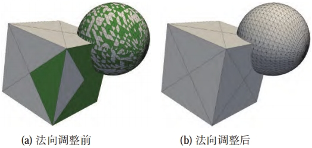

### 曲面求交

​	为了恢复模型的所有原始边界，本模块使用原始边界的三角面片所在的平面来切割四面体。非退化情况下四面体单元被原始表面单元所在平面切割如图所示：

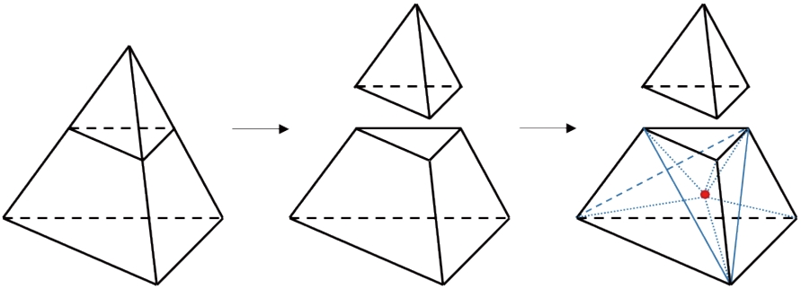

被切割的四面体单元的侧面将会被截断为一个四边形和一个三角形，该四面体单元将形成一个四面体单元和一个五面体单元。首先对侧面的三个四边形分别进行Delaunay三角化，再对该五面体单元进行分割，在其重心处插入新点，与侧面的新三角形顶点连接后形成分裂后的新四面体单元。贴合问题将产生零体积的四面体单元，本算法中的三角形求交计算全部采用基于GMP的高精度有理数计算，退化情况下舍弃零体积的新单元即可。基于精确的求交计算，本模块可以保证输入模型中的所有自相交问题可以得到修复。

​	下图展示了利用原始边界切割四面体解决相交问题，图(a)中红色四面体与蓝色的原始边界出现相交，图(b)为该四面体的底面。利用原始边界切割四面体，其结果如图(c)和图(d)所示：

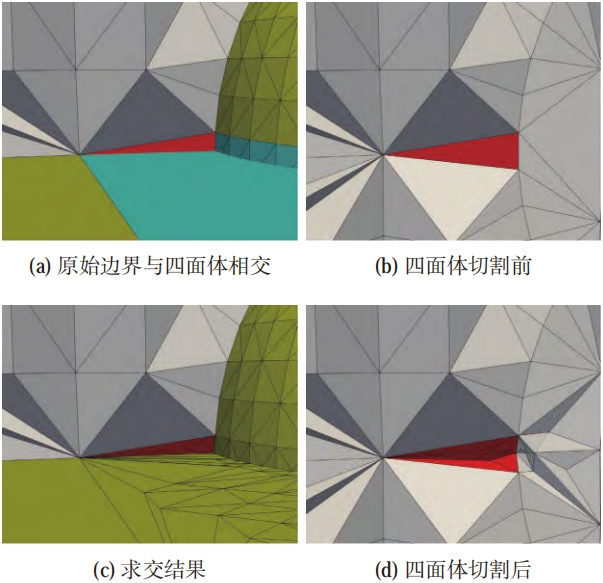

### 四面体网格优化

​	四面体-平面求交可以在有理数的范围内修复脏几何的自相交问题，但模型仍可能存在狭缝等不必要的细小特征。由于前述步骤已经完成了输入模型原始表面的恢复，那么在狭缝处必然存在狭窄甚至是退化的四面体单元，因此优化此处的四面体单元质量即可抹除此类特征。下图展示了通过四面体优化解决狭缝的详细过程：

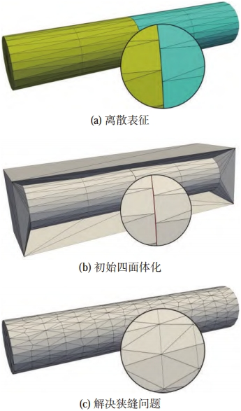

图示两圆柱之间存在狭缝需要被抹除，经过初始四面体化后，如图(b)所示，狭缝处产生了图示红色的四面体单元，这类四面体单元的质量较差，经过四面体质量提升后，这类单元被抹去，得到的表面如图(c)所示。

​	该算法主要分为四面体质量提升、包络检测与容差场两个步骤进行：

#### 	1. 四面体质量提升

​		四面体单元质量的提升主要操作为边分裂、边折叠、面交换与点优化四种局部操作，如下图所示：

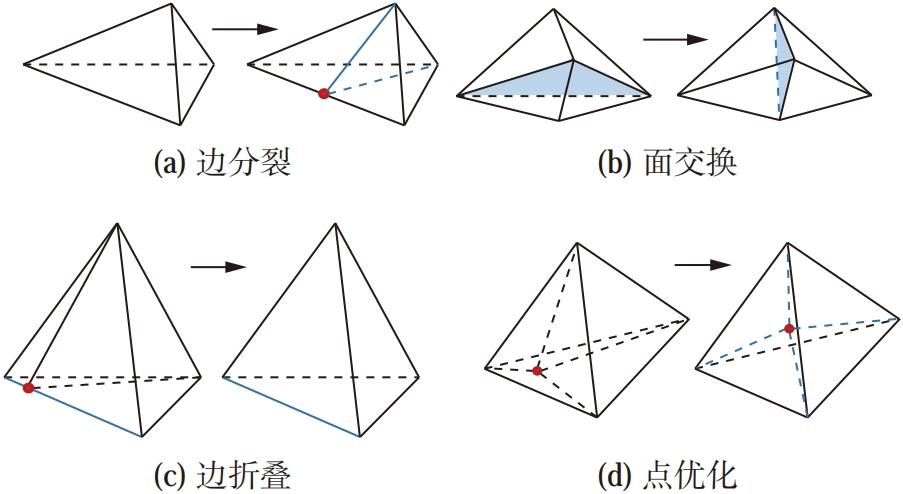

本模块通过循环执行这四种局部操作来逐步优化四面体单元。

​	本模块采用能量函数作为四面体单元的质量标准，该函数具有天然的各向同性，可以有效地甄别出各向异性的和负体积的四面体单元公式如下：
$$
E_t=\frac{\mathrm{tr}(J_t^TJ_t)}{\det(J_t)^{\frac{2}{D}}}
$$
其中，_J<sub>t</sub>_是将单元_t_转化为正单元（三维时为正四面体）的雅可比矩阵，_D_为网格维度，衡量四面体单元质量时取3。当某一单元的能量函数值大于临界值时，将被视为差单元，并通过上述质量提升操作提升单元质量。

​	定义理想单元尺寸为_l_，上述四种操作中可以影响单元边长的操作为边分裂和边折叠操作。当四面体单元某一边长大于√2 _l_时，将对该边执行边分裂操作；当四面体单元某一边长小于√2/2 _l_，且执行边折叠后合并得到的单元质量提高，则对该边执行边折叠操作，边折叠操作是修复狭缝的主要手段。

​	四面体网格质量优化的目的是解决狭缝或重叠处产生的狭窄的或退化的四面体单元，对于空间中的四面体，其质量评判标准不同。为了加速优化效率，本模块采用了多级能量阈值判别方案，即每个四面体单元优化的目标能量值不同，这里我们采用四面体单元至边界的距离来计算该单元的能量阈值。令原始表面附近的单元的目标能量值为_E<sub>ts</sub>_，该三角化中允许的最大能量值为_kE<sub>ts</sub>_，则空间中某一四面体的目标优化质量_E<sub>t</sub>_可以通过线性插值得到,即：
$$
E_t=[1+\frac{2d_s}{L}(k-1)]E_{ts}
$$
其中，_d<sub>s</sub>_为该四面体与输入表面的最短距离。靠近表面的四面体单元，其目标能量值较小，而远离所有表面的四面体单元，其目标能量值较大，允许在距离表面远处产生较差的四面体单元。

#### 	2. 包络检测与容差场

​	上述四面体网格质量优化方法中，边折叠与点优化涉及网格点的位移操作，若网格点的偏移量过大，可能导致网格与输入模型之间产生较大的偏差，因此本模块将禁止这样的边折叠与点优化操作。为了确保本算法生成的表面网格与输入模型之间的误差在可控范围内，每次边折叠与点优化的操作执行后，需要进行包络检测以确保生成保形的表面网格，包络检测的方法如下：

​	记待检测的三角形为_T_，允许的最大容差为_ɛ_，对_T_进行均匀采样，采样点以边长为_d_的正三角形均匀分布，并在边界处添加采样，采样点的最大误差为_d_/√3，如下图所示：

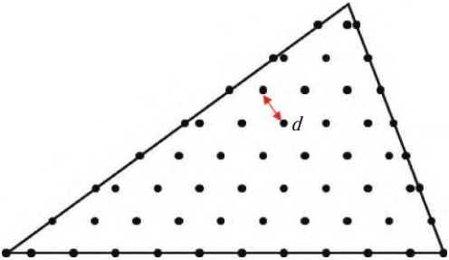

若_T_中的所有采样点与输入边界的最小距离均小于_ɛ_-_d_/√3，则认为该三角形单元位于输入边界的包络内。根据不同的场景需求，可以设定不同精度的采样点，随着_d_的减小，包络检测耗费的时间越长，检测的精度也越高。

​	由上述采样方法可知，实际采样点允许的容差值小于_ɛ_，倘若某一采样点计算得到的最近距离小于_ɛ_但大于_ɛ_-_d_/√3，将会产生错误判断。这种错误的判断将影响网格质量优化的性能与结果，因为一次边折叠或点优化的失败，该单元将继续执行边分裂操作，产生更多的单元，随着单元数量的上升，降低优化质量的同时也会降低网格优化的速度。

​	为解决上述问题，本模块采用多级的包络检测，第_k_级包络检测的采样点间距_d<sub>k</sub>_=_d_/_k_，若第_k_级检测中所有的采样点至输入边界的最小距离均小于_ɛ_-_d<sub>k</sub>_/√3，则认为该三角形单元位于输入边界的包络内。

​	容差_ɛ_的设置将会影响包络检测的时间效率与精确性，同时也会影响模型缺陷的修复效果。若要修复模型中的狭缝，那么此处的容差值应当大于狭缝的宽度，但其它区域应当尽可能地保证边界不发生改变。因此，我们定义了基于离散表征的容差场，任意一点处的容差分为两部分，全局容差值_ɛ_<sub>0</sub>与局部容差值_ɛ<sub>p</sub>_，该点处的容差值取两者中较小的一个。某一部件的_ɛ_<sub>0</sub>为该部件的包围盒对角线长度的千分之一，局部容差值_ɛ<sub>p</sub>_需根据模型需求，在需要修复的狭缝区域设置较大的容差值，在必须严格保持的特征处设置较小的容差值。如图所示，可以通过设置楔形体脊边处的容差值为一个较小的容差值，实现特征保持的效果。

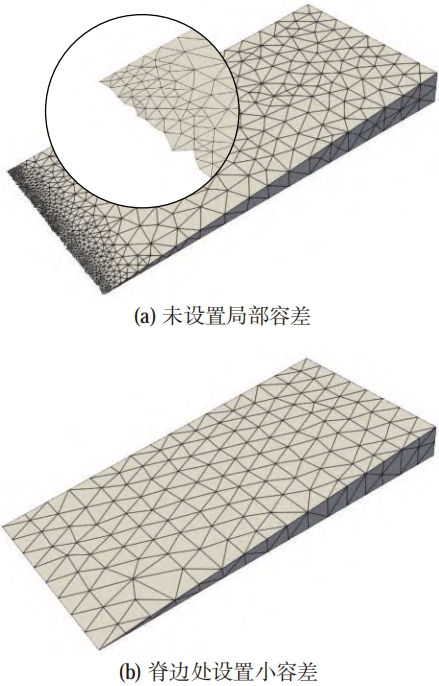

​	曲面求交与四面体质量提升两个环节中均可能产生新的边界点，新的边界点都是由边分裂形成的，故新边界点的容差值应取其边分裂前的两端点处容差值的最小值。

### 案例

​	本模块已经将自动网格修复生成的具体过程封装在了`TiGER::discrete_geometry_repair::TMeshSurf_Repair`中，它包含在头文件`autogrid.h`里面。使用时只需要定义自动网格修复输入网格`autogrid_surf_in`，自动网格修复输出网格`autogrid_surf_out`，自动网格修复参数`autogrid_args`后，设置自动网格修复参数`autogrid_args`的一些变量：容差`autogrid_epsilon`，最大迭代次数`autogrid_max_passes`，局部容差`autogrid_use_local`，修复完后是否退出`autogrid_use_round`，便可调用API`TiGER::discrete_geometry_repair::TMeshSurf_Repair`，输入离散后的面网格`autogrid_surf_in`和自动网格修复参数`autogrid_args`，输出修复后的面网格`autogrid_surf_out`，代码如下：

```cpp
TiGER::SurfaceMesh autogrid_surf_in, autogrid_surf_out;
TiGER::AutogridParameters autogrid_args;
autogrid_args.seteps_rel(autogrid_epsilon);
autogrid_args.setmax_num_passes(autogrid_max_passes);
autogrid_args.setuse_local(autogrid_use_local);
autogrid_args.setuse_round(autogrid_use_round);
autogrid_surf_in = stl_surface_out;
TiGER::discrete_geometry_repair::TMeshSurf_Repair(autogrid_surf_in, autogrid_args, autogrid_surf_out);
```

​	下图以圆盘为例，分别展示了经过离散后的圆盘在自动网格修复生成前与自动网格修复生成后的表面网格差别，可以看出表面网格质量有明显提升。

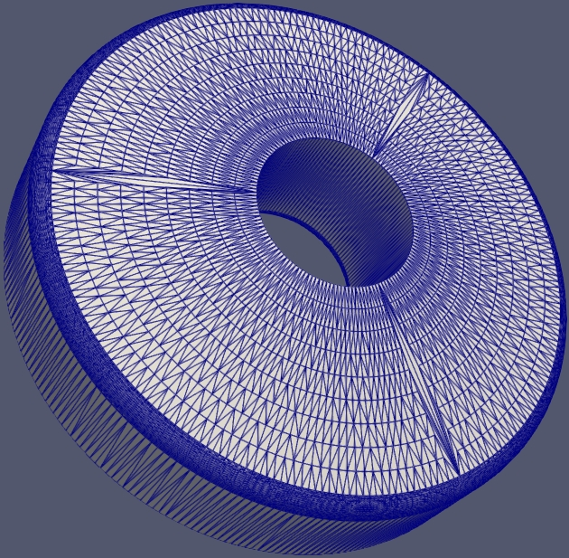

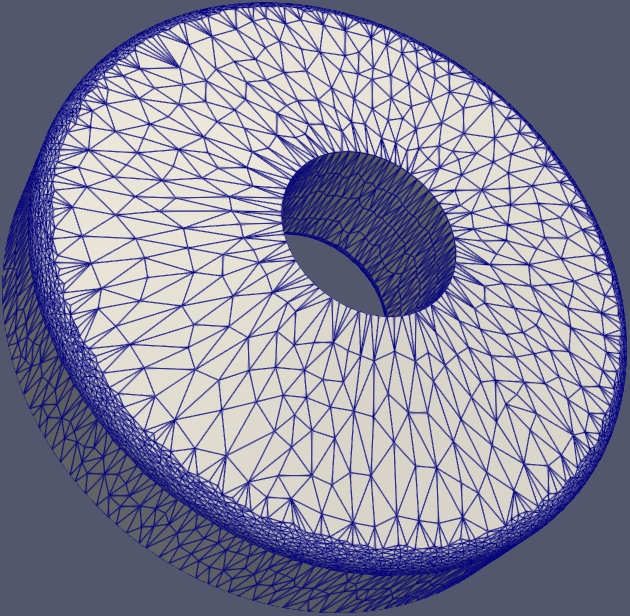

### 输入输出

* 输入：
  * STL背景网格
* 输出：
  * 表面网格

### API

1. TiGER::discrete_geometry_repair::TMeshSurf_Repair

   ```cpp
   void TMeshSurf_Repair(const SurfaceMesh& surf_in,
                            const AutogridParameters& args,
                            SurfaceMesh& surf_out);
   ```

   * 输入：
     * surf_in：输入的背景网格
     * args：自动网格修复生成参数
   * 输出：
     * surf_out：输出的表面网格
   * 返回值：
     * 无
   * 功能：
     * 将输入的`surf_in`背景网格依据自动网格修复生成参数`args`，生成表面网格`surf_out`

### 效果演示


## 尺寸场生成模块

### 概述

​	尺寸函数与网格生成算法紧密关联，使用合适的尺寸函数可以更精确地控制网格单元的大小和分布，从而进一步提高计算精度与效率。因此，在使用非结构化网格生成算法时，制定适当的尺寸函数策略应对复杂的场景应尤为重要。根据不同的需求，尺寸函数可以分为两类：基于计算的尺寸函数和基于几何的尺寸函数。基于计算的尺寸函数通常被设计用于模拟结果的适应性和误差分析，基于几何特征的尺寸函数则更加注重几何形状的特征。本模块为基于几何的尺寸函数生成。

​	典型的几何特征包括曲率特征和邻近特征。曲率主要表征模型的弯曲程度，当模型的曲率越高，为了保证网格模型的几何精度，需要将网格单元的尺寸设计得足够细致，以便更好地逼近曲面；相反，当模型的曲率较低时，则可以适当增加网格单元的尺寸，以提高网格生成的效率。邻近特征则表征模型要素之间的距离，对于网格生成来说，处理邻近特征并不会对网格模型的几何精度产生直接影响，但会影响特征附近网格单元的质量。如果特征之间的距离过大或过小，可能导致网格单元之间出现骨刺或者凹陷等问题，影响模型的可用性和精度。本模块主要解决了几何自适应网格生成中曲率特征自适应以及邻近特征自适应尺寸函数自动生成的关键问题。

### 曲率特征自适应单元尺寸计算

​	已知采样点_S_的曲率半径_r<sub>s</sub>_=1/_k_，_k_为其曲率值，构造一个圆心与采样点的连线_OS_与采样点法向量重合，半径与_r<sub>s</sub>_相等的圆，如图所示：

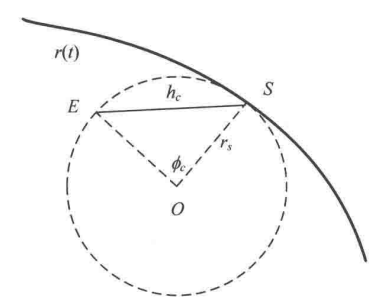

_S_点处的单元尺寸以及生成的网格边_SE_与其张角_ɸ_<sub>c</sub>有关系：
$$
h_{c}(S) = |SE| = 2r_{s}\sin(\frac{\phi_{c}}{2})
$$
其中网格边_SE_应尽可能贴合曲面，即其张角_ɸ<sub>c</sub>_应该尽可能小，_ɸ<sub>c</sub>_为用户参数。

### 线邻近特征单元尺寸计算

​	借助形体中轴可以直观且准确地表示线邻近特征。本模块采用Delaunay三角化来得到形体中轴的离散化表示，如图:

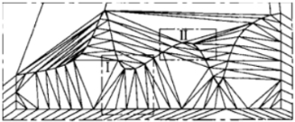

根据中轴性质，当均匀采样的尺寸值趋近于0时，并且排除了外部的三角形单元后，该平面点集Delaunay三角化的外接圆就趋近于形体的中轴内切圆，即点集的外接圆圆心集趋近于形体的中轴。

​	对于形体边界上一点，可以用该点到形体中轴的距离表示其邻近特征。而当形体的中轴是离散的表达时，可以用采样点到中轴离散点的距离近似表示该点到中轴的距离。由于中轴离散点来源于边界采样点的Delaunay三角化，因此对于一个采样点_S_，本模块通过遍历包含该点的Delaunay三角形_T<sub>i</sub>_(_i_=1,2,...,_k_)的外心_O<sub>i</sub>_(_i_=1,2,...,_k_)，_S_与_O<sub>i</sub>_的距离为_r<sub>i</sub>_，_r<sub>i</sub>_中的最小值即为采样点_S_到中轴的距离即：

$$
d_s = \min \{ r_1, r_2, \ldots, r_k \}
$$

可以定义一个用户设置的参数_μ<sub>p</sub>_，1/_μ<sub>p</sub>_用于表示_S_到中轴中间可以设置网格单元的数量。而采样点_S_的邻近特征自适应单元尺寸值_h<sub>pc</sub>_(_S_)即为：
$$
h_{pc}(S) = d_{s} \times \mu_{p}
$$


### 面邻近特征单元尺寸计算

​	本模块采用ray-casting技术计算每个网格点的面邻近距离。对于网格单元_T_的外心_C_,由_C_沿着其法向射出一条射线_l_，_l_的长度是一直增长的。当_l_与一个单元产生碰撞时，碰撞点为_P_。当此时的_l_符合以下条件：
$$
l_{min}\leq l\leq l_{bound}
$$
则认为此处的面邻近是有效的，并收录该面邻近特征，其中：
$$
\begin{cases}
l_{min}=\frac{h_{\min}}{μ_p}\\
l_{bound}=\min(\max(\frac{S_{\max}}{μ_p},l_{\min}),l_{\max})
\end{cases}
$$
其中，_l_<sub>max</sub>=_h_<sub>max</sub>/_μ<sub>p</sub>_，_S_<sub>max</sub>为单元_T_的节点尺寸值中的最大值。如果此时l的长度小于长度范围的下限，则l长度继续增长。而当l的长度超过长度范围上限时，说明此处不需要讨论面邻近特征。

​	对于一个存在有效_l<sub>i</sub>_的网格单元_T<sub>i</sub>_，其邻近特征自适应单元尺寸值可用下面的公式计算：
$$
h_{ps}(S_i)=l_i\times\mu_p
$$

### 案例

​	本模块已经将尺寸场的具体计算生成封装在了`TiGER::size_field::setSizeField`中，它包含在头文件`sizing_field_interface.h`里面。使用时只需要定义尺寸场管理器`sf`和背景参数`bkg_args`后，设置背景参数`bkg_args`中的一些变量：最小尺寸`size_hmin`，最大尺寸`size_hmax`，尺寸过度因子`size_theta`，曲率自适应因子`size_beta`，邻近因子`size_proximity`，便可调用API`TiGER::size_field::setSizeField`，输入修复后的面网格`autogrid_surf_out`和背景参数`bkg_args`，输出尺寸场管理器`sf`，代码如下：

```cpp
#include "sizing_field_interface.h"
#include "sizing_field_parameters.h"
TiGER::SizingManager sf;
TiGER::BackGroundParameters bkg_args;
bkg_args.sethmin(size_hmin);
bkg_args.sethmax(size_hmax);
bkg_args.settheta(size_theta);
bkg_args.setbeta(size_beta);
bkg_args.setproximity(size_proximity);
TiGER::size_field::setSizeField(autogrid_surf_out, bkg_args, sf);
```

### 输入输出

* 输入：
  * 表面网格
* 输出：
  * 尺寸场

### API

1. TiGER::size_field::setSizeField

   ```cpp
   void setSizeField(const SurfaceMesh& SurfaceMesh,
         			  const BackGroundParameters& args,
         			  SizingManager& sf);
   ```

   * 输入：
     * SurfaceMesh：表面网格
     * args：背景场参数
   * 输出：
     * sf：尺寸场管理器
   * 返回值：
     * 无
   * 功能：
     * 依据输入的表面网格`SurfaceMesh`和背景场参数`args`，生成尺寸场管理器`sf`

### 效果演示


## 重网格划分模块

### 概述

​	本模块采用经典的网格重构策略完成曲面重网格划分，其核心算法与四面体网格重构相同，对需要优化的单元依次执行边分裂、边折叠、边交换与点优化操作，直至所有的表面网格均满足质量要求。

### 曲面网格重构

​	本模块中的尺寸场已在尺寸场生成模块进行定义。曲面网格单元的衡量标准采用面积与边长之比的平方和，表面网格中的每个点都记录其理想边长_L_<sub>ideal</sub>，_L_<sub>ideal</sub>的值可以通过查询离散尺寸场并线性插值得到，当网格边长大于√2 _L_<sub>ideal</sub>时，执行边分裂操作，当网格边长小于√2/2 L_<sub>ideal</sub>时，执行边折叠操作。

​	为了生成保形的表面网格，本模块要求在重构过程中由于边分裂产生的新点、点优化后的点都能尽可能地贴近原始表面。网格重构中的误差估计通过计算Hausdorff距离来衡量，本模块要求所有的网格点距离输入边界的Hausdorff距离均小于_h_<sub>max</sub>。由于表面网格优化中存在点优化的操作，在狭窄的区域有可能出现网格自相交的情况。为了避免这种情况，本模块采用多级误差来避免由表面网格重构引起的表面自相交。在执行完毕一次曲面网格重构后，检测所有的表面网格是否存在自相交的情况，对于存在自相交的表面，令_h_'<sub>max</sub>=_h_<sub>max</sub>/2，重新进行曲面网格重构，直至表面不存在自相交的区域。

### 案例

​	本模块已经将重网格划分具体过程生成封装在了`TiGER::discretize_surface_remesh::TMeshSurf_Opt`中，它包含在头文件`discretize_surface_remesh.h`里面。使用时只需要定义重网格划分输入网格`remesh_surf_in`，重网格划分输出网格`remesh_surf_out`，重网格划分控制参数`args_remesh`,硬约束边`constrained_edge`，软约束边`conformaing_edge`，尺寸场`size_function`后，设置重网格划分控制参数`args_remesh`中的一些变量：是否使用尺寸场`setb_sizefunction`，重网格划分保形度`seteps_rel`，将尺寸场的值由尺寸场生成模块中的尺寸场管理器进行赋值，便可调用API`TiGER::discretize_surface_remesh::TMeshSurf_Opt`，输入修复后的面网格`remesh_surf_in`，硬约束边`constrained_edge`，软约束边`conformaing_edge`，重网格划分控制参数`args_remesh`，尺寸场`size_function`，重网格划分后的面网格`remesh_surf_out`和硬约束边`constrained_edge`，代码如下：

```cpp
TiGER::SurfaceMesh remesh_surf_in = autogrid_surf_out;
TiGER::SurfaceMesh remesh_surf_out;
TiGER::RemeshParameters args_remesh;
args_remesh.setb_sizefunction(true);
args_remesh.seteps_rel(remesh_epsilon);
std::vector<std::vector<int>> constrained_edge;
std::vector<std::vector<int>> conformaing_edge;
std::function<double(double, double, double)> size_function = sf.sf[0];
std::function<double(double, double, double)> scaled_size_function = [&](double x, double y, double z)
{
	return size_scale_factor * size_function(x, y, z);
};
std::vector<std::vector<int>> constrained_edge_out;
TiGER::discretize_surface_remesh::TMeshSurf_Opt(remesh_surf_in, constrained_edge, conformaing_edge, args_remesh,scaled_size_function, remesh_surf_out, constrained_edge_out);
```

​	下图以圆盘为例，分别展示了经过自动网格修复生成后的圆盘在重网格划分前与重网格划分后的表面网格差别，可以看出经过重网格划分后，已经生成了单元质量好，疏密有致的面网格。

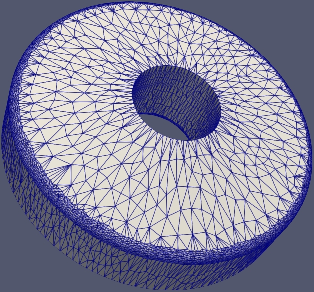

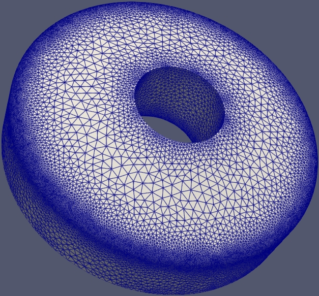

### 输入输出

* 输入：

  * 表面网格

    和

  * 尺寸场

* 输出：尺寸调整后的表面网格

### API

1. TiGER::discretize_surface_remesh::TMeshSurf_Opt

   ```cpp
   void TMeshSurf_Opt(const SurfaceMesh &surfmesh_in,
               		const std::vector<std::vector<int>> &constrained_edge,
               		const std::vector<std::vector<int>> &conforming_edge,
               		const RemeshParameters &args,
               		const std::function<double(double, double, double)> &size_function,
               		SurfaceMesh &surfmesh_out,
               		std::vector<std::vector<int>> &constrained_edge_out);
   ```

   * 输入：
     * surfmesh_in：尺寸调整前的表面网格
     * constrained_edge_out：硬约束边
     * conforming_edge：软约束边
     * args：重网格划分控制参数
     * size_function：尺寸场
   * 输出：
     * surfmesh_out：尺寸调整后的表面网格
     * constrained_edge_out：硬约束边
   * 返回值：
     * 无
   * 功能：
     * 将输入的表面网格`surfmesh_in`依据硬约束边`constrained_edge_out`、软约束边`conforming_edge`、重网格划分控制参数`args`和尺寸场`size_function`，生成尺寸调整后的表面网格`surfmesh_out`和硬约束边`constrained_edge_out`

### 效果演示


## 体网格生成模块

###  功能

​	根据表面网格生成体网格

### 输入输出

* 输入：
  * 表面网格
* 输出：
  * 体网格

### API

1. TiGER::tetrahedral_mesh::TetGrid_Constrained

   ```cpp
   void TetGrid_Constrained(const SurfaceMesh &surface_mesh,
                          const TetrahedraParameters &args,
                          const SizingFunction &func,
                          VolumeMesh &volume_mesh);
   ```

   * 输入：
     * surface_mesh：表面网格
     * args：体网格生成控制参数
     * func：尺寸场
   * 输出：
     * volume_mesh：体网格
   * 返回值：
     * 无
   * 功能：
     * 依据输入的表面网格`surface_mesh`、体网格生成控制参数`args`和尺寸场`func`，生成体网格`volume_mesh`

### 效果演示


## 安装

​	在Linux环境下解压`tiger1.5_to_huawei.tar.gz`压缩包，并在安装目录使用命令行命令`cmake ..`进行安装

## 编译

​	在安装目录使用命令行命令`make`进行编译

## 运行

 1. 添加依赖库：

    使用命令行命令`export LD_LIBRARY_PATH={项目位置}/extern/OpenCasCade/lib:{项目位置}/extern/tiger:$LD_LIBRARY_PATH`添加OCC依赖库至项目程序

 2. 运行：

    * 默认运行命令：在安装目录使用命令行命令`./tigerdemo_AutoGrid -i {文件名}.{文件后缀}`

    * 帮助命令：在安装目录使用命令行命令`./tigerdemo_AutoGrid -h`

    * 其它命令：

      |命令|功能|变量取值范围|变量类型|默认值|
      |:-|:-|:-|:-|:-|
      |-i, --input {变量}|输入模型文件名|-|String|空|
      |-o, --output {变量}|输出体网格文件名|-|String|空|
      |-d, --debug {变量}|开启调试模式，输出中间网格文件|true,false|bool|false|
      |--use-stl {变量}|将stl文件作为输入文件|true,false|bool|false|
      |--no-remesh {变量}|关闭重网格划分|true,false|bool|false|
      |--geo-getname {变量}|获取文件名|true,false|bool|false|
      |--geo-divideclosed {变量}|切割封闭面|true,false|bool|true|
      |--geo-bool {变量}|解决布尔问题|true,false|bool|true|
      |--geo-heal {变量}|几何修复功能参数|[0,63]|int|39|
      |--stl-deflection {变量}|位移偏差|(0,+∞)|double|0.001|
      |--stl-angle {变量}|角度偏差|[0,180]|double|5.0|
      |--stl-min-size {变量}|网格单元最小尺寸|(0,+∞)|double|1e-7|
      |--stl-relative {变量}|位移偏差以绝对值形式传入|true,false|bool|false|
      |--stl-in-parallel {变量}|并行处理|true,false|bool|true|
      |--stl-internal-vertices-mode {变量}|内部顶点模式|true,false|bool|true|
      |--stl-control-surface-deflection {变量}|表面位移偏差|true,false|bool|true|
      |--size-scale-factor {变量}|尺寸场放缩因子|(0,+∞)|double|1.0|
      |--size-hmin {变量}|全局最小尺寸|(0,+∞)|double|-1|
      |--size-hmax {变量}|全局最大尺寸|(0,+∞)|double|-1|
      |--size-theta {变量}|曲率适应参数(弧度)|(0,+∞)|double|0.1|
      |--size-beta {变量}| 默认相邻单元尺寸梯度值|(1,+∞)|double|1.2|
      |--size-proximity {变量}|邻近因子|(0,+∞)|double|2.0|
      |--remesh-epsilon {变量}|重网格划分保形度|[1e-5,1e-2]|double|1e-3|
      |--autogrid-epsilon {变量}|自动网格划分保形度|[1e-8,1e-2]|double|1e-4|
      |--autogrid-max-passes {变量}|最大迭代次数|[0,1000]|int|5|
      |--autogrid-use-local {变量}|采用局部策略加速|true,false|bool|false|
      |--autogrid-use-round {变量}| 关闭网络优化                   |true,false|bool|false|

      

