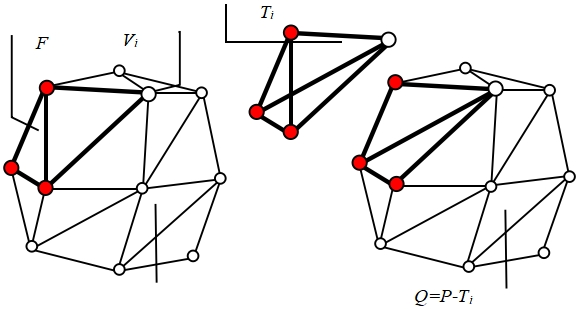

# 					Tiger 1.5 to Huawei

## 简介

​	Tiger 1.5 to Huawei 是一个集成了Tiger 1.5 几何处理模块、自动网格修复生成模块、尺寸场生成模块、重网格划分模块、体网格生成模块的C++几何处理体网格生成程序。它只需在Linux环境下借助CMake进行项目构建编译后便可在终端通过输入命令的方式进行使用。根据在命令行输入的命令不同，程序可以以**直接运行**或**调试运行**两种模式运行。

## 几何处理模块

### 功能

​	将几何模型或背景网格处理为程序所要求的背景网格

### 输入输出

 * 输入：
   * STP或IGS模型
   
     或
   
   * STL背景网格
   
 * 输出：
   * STL背景网格

### API

* 模块输入为模型时：

  1. TiGER::Read_Model
     
     ```cpp
     void Read_Model(const std::string& filename,
                        const readModelParameters &args,
  	                   TIGER::Geometry& geometry);
  	```
  	
  	* 输入：
  	  * filename：要处理的模型名
  	  * args：几何处理参数
  	* 输出：
  	  * geometry：处理后的几何模型
  	* 返回：
  	  * 无
  	* 功能：
  	  * 将几何模型`filename`依据几何处理参数`args`处理为几何模型`geometry`
  	
   2. TiGER::CAD_Tessellation

      ```cpp
      void CAD_Tessellation(const TiGER::Geometry& geometry,
                           const TiGER::generateStlParameters& arg_stl,
                           TiGER::SurfaceMesh& surfaceOut);
      ```

      * 输入：
        * geometry：处理后的几何模型
        * arg_stl：背景网格处理参数
      * 输出：
        * surfaceOut：输出的背景网格
      * 返回
      	* 无
      * 功能：
        * 将几何模型`geometry`依据背景网格处理参数`arg_stl`处理为背景网格`surfaceOut`

* 模块输入为背景网格时：

  1. TiGER::MESHIO::readVTK
  
     ```cpp
     int readVTK(const std::string& filename,
                 const std::string& mark_pattern,
                 Mesh& mesh);
     ```
     
     * 输入：
       * filename：要处理的模型名
       * mark_pattern：写入vtk文件的属性名称
	   * 输出：
       * mesh：存储网格信息
     * 返回值：
       * 1：函数成功完成所有操作
       * 0：输入文件格式有问题
       * -1：无法打开输入文件
     * 功能：
       * 读取一个 VTK 文件`filename`，并将其中的几何和拓扑数据解析并存储到一个 `Mesh` 对象中
     
   2. TiGER::matrix_to_list<>
  
         ```cpp
         template <int dim, typename DerivedM>
         //dim = 1
         void matrix_to_list(const Eigen::DenseBase<DerivedM>& M,
         					std::vector<typename DerivedM::Scalar>& V);
      //dim >1
      void matrix_to_list(const Eigen::DenseBase<DerivedM>& M,
          				std::vector<std::array<typename DerivedM::Scalar, dim>>& V);
      ```
      
      *  输入：
        * M：输入的 Eigen 矩阵，该矩阵类型 `DerivedM` 是派生自 `Eigen::DenseBase` 的具体类型，该矩阵的列数应等于模板参数 `dim`
      
      * 输出：
        * V：输出的向量，类型为 `DerivedM::Scalar`
      
      * 返回值：
        * 无
      
      * 功能：
        * 将输入的 Eigen 矩阵 `M` 转换为一个包含定长数组的向量 `V`

### 效果演示


## 自动网格修复生成模块

### 概述

​	本模块针对几何中可能出现的法向错误、穿插、狭缝、贴合问题，通过四面体化方法自动修复几何，并生成高质量的曲面网格。其核心思想是一个有效的四面体网格的表面一定是一个有效的曲面网格。本模块在输入模型的离散表征的基础上直接生成四面体网格，通过离散边界切割四面体解决了模型中存在的穿插问题，基于四面体优化解决狭缝和贴合问题，此时该四面体网格的表面便是有效的曲面网格，提取该表面网格，得到修复后的表面网格模型，流程图如下：


<center>图1</center>

### 法向调整

​	本模块采用基于视图采样的法向调整策略，通过绘制该离散模型在各个方向上的视图，可以计算该模型中任意一个面片法向的可能性。理想情况下，我们在任意一个观测点_V_观察该模型，对于观察到的某一个三角形中的某一点_p_，视线方向(_v_-_p_)与该三角形的法向_n_应满足：
$$
(\mathbf{v} - \mathbf{p}) \cdot \mathbf{n} \leq 0
$$
​	定义三角面片_t<sub>i</sub>_的法向正确的概率为_P_(_t<sub>i</sub>_)。本模块对该模型建立一个包围球，从包围球上均匀选取_N_个观测点对该模型进行绘制，得到_N_张1024×1024的图像。定义_O_<sub>+</sub>(_t<sub>i</sub>_)为三角面片_t<sub>i</sub>_在所有视图中法向与视线夹角大于 90°的像素点数，_O_<sub>-</sub>(_t<sub>i</sub>_)为三角面片_t<sub>i</sub>_在所有视图中法向与视线夹角小于90°的像素点数。最终可计算得到三角面片法向正确的概率为：
$$
P(t_i)=\frac{O_+(t_i)}{O_+(t_i)+O_-(t_i)}
$$
若_P_(_t<sub>i</sub>_)>0.5，将保持该面片的法向，否则将该三角面片的法向翻转。

​	下面为法向调整前后的对比，其中绿色表示该三角面片的法向指向体的内部：


<center>图2</center>

### 曲面求交

​	为了恢复模型的所有原始边界，本模块使用原始边界的三角面片所在的平面来切割四面体。非退化情况下四面体单元被原始表面单元所在平面切割如图所示：


<center>图3</center>

被切割的四面体单元的侧面将会被截断为一个四边形和一个三角形，该四面体单元将形成一个四面体单元和一个五面体单元。首先对侧面的三个四边形分别进行Delaunay三角化，再对该五面体单元进行分割，在其重心处插入新点，与侧面的新三角形顶点连接后形成分裂后的新四面体单元。贴合问题将产生零体积的四面体单元，本算法中的三角形求交计算全部采用基于GMP的高精度有理数计算，退化情况下舍弃零体积的新单元即可。基于精确的求交计算，本模块可以保证输入模型中的所有自相交问题可以得到修复。

​	下图展示了利用原始边界切割四面体解决相交问题，图(a)中红色四面体与蓝色的原始边界出现相交，图(b)为该四面体的底面。利用原始边界切割四面体，其结果如图(c)和图(d)所示：


<center>图4</center>

### 四面体网格优化

​	四面体-平面求交可以在有理数的范围内修复脏几何的自相交问题，但模型仍可能存在狭缝等不必要的细小特征。由于前述步骤已经完成了输入模型原始表面的恢复，那么在狭缝处必然存在狭窄甚至是退化的四面体单元，因此优化此处的四面体单元质量即可抹除此类特征。下图展示了通过四面体优化解决狭缝的详细过程：


<center>图5</center>

图示两圆柱之间存在狭缝需要被抹除，经过初始四面体化后，如图(b)所示，狭缝处产生了图示红色的四面体单元，这类四面体单元的质量较差，经过四面体质量提升后，这类单元被抹去，得到的表面如图(c)所示。

​	该算法主要分为四面体质量提升、包络检测与容差场两个步骤进行：

#### 	1. 四面体质量提升

​		四面体单元质量的提升主要操作为边分裂、边折叠、面交换与点优化四种局部操作，如下图所示：


<center>图6</center>

本模块通过循环执行这四种局部操作来逐步优化四面体单元。

​	本模块采用能量函数作为四面体单元的质量标准，该函数具有天然的各向同性，可以有效地甄别出各向异性的和负体积的四面体单元公式如下：
$$
E_t=\frac{\mathrm{tr}(J_t^TJ_t)}{\det(J_t)^{\frac{2}{D}}}
$$
其中，_J<sub>t</sub>_是将单元_t_转化为正单元（三维时为正四面体）的雅可比矩阵，_D_为网格维度，衡量四面体单元质量时取3。当某一单元的能量函数值大于临界值时，将被视为差单元，并通过上述质量提升操作提升单元质量。

​	定义理想单元尺寸为_l_，上述四种操作中可以影响单元边长的操作为边分裂和边折叠操作。当四面体单元某一边长大于√2 _l_时，将对该边执行边分裂操作；当四面体单元某一边长小于√2/2 _l_，且执行边折叠后合并得到的单元质量提高，则对该边执行边折叠操作，边折叠操作是修复狭缝的主要手段。

​	四面体网格质量优化的目的是解决狭缝或重叠处产生的狭窄的或退化的四面体单元，对于空间中的四面体，其质量评判标准不同。为了加速优化效率，本模块采用了多级能量阈值判别方案，即每个四面体单元优化的目标能量值不同，这里我们采用四面体单元至边界的距离来计算该单元的能量阈值。令原始表面附近的单元的目标能量值为_E<sub>ts</sub>_，该三角化中允许的最大能量值为_kE<sub>ts</sub>_，则空间中某一四面体的目标优化质量_E<sub>t</sub>_可以通过线性插值得到,即：
$$
E_t=[1+\frac{2d_s}{L}(k-1)]E_{ts}
$$
其中，_d<sub>s</sub>_为该四面体与输入表面的最短距离。靠近表面的四面体单元，其目标能量值较小，而远离所有表面的四面体单元，其目标能量值较大，允许在距离表面远处产生较差的四面体单元。

#### 	2. 包络检测与容差场

​	上述四面体网格质量优化方法中，边折叠与点优化涉及网格点的位移操作，若网格点的偏移量过大，可能导致网格与输入模型之间产生较大的偏差，因此本模块将禁止这样的边折叠与点优化操作。为了确保本算法生成的表面网格与输入模型之间的误差在可控范围内，每次边折叠与点优化的操作执行后，需要进行包络检测以确保生成保形的表面网格，包络检测的方法如下：

​	记待检测的三角形为_T_，允许的最大容差为_ɛ_，对_T_进行均匀采样，采样点以边长为_d_的正三角形均匀分布，并在边界处添加采样，采样点的最大误差为_d_/√3，如下图所示：


<center>图7</center>

若_T_中的所有采样点与输入边界的最小距离均小于_ɛ_-_d_/√3，则认为该三角形单元位于输入边界的包络内。根据不同的场景需求，可以设定不同精度的采样点，随着_d_的减小，包络检测耗费的时间越长，检测的精度也越高。

​	由上述采样方法可知，实际采样点允许的容差值小于_ɛ_，倘若某一采样点计算得到的最近距离小于_ɛ_但大于_ɛ_-_d_/√3，将会产生错误判断。这种错误的判断将影响网格质量优化的性能与结果，因为一次边折叠或点优化的失败，该单元将继续执行边分裂操作，产生更多的单元，随着单元数量的上升，降低优化质量的同时也会降低网格优化的速度。

​	为解决上述问题，本模块采用多级的包络检测，第_k_级包络检测的采样点间距_d<sub>k</sub>_=_d_/_k_，若第_k_级检测中所有的采样点至输入边界的最小距离均小于_ɛ_-_d<sub>k</sub>_/√3，则认为该三角形单元位于输入边界的包络内。

​	容差_ɛ_的设置将会影响包络检测的时间效率与精确性，同时也会影响模型缺陷的修复效果。若要修复模型中的狭缝，那么此处的容差值应当大于狭缝的宽度，但其它区域应当尽可能地保证边界不发生改变。因此，我们定义了基于离散表征的容差场，任意一点处的容差分为两部分，全局容差值_ɛ_<sub>0</sub>与局部容差值_ɛ<sub>p</sub>_，该点处的容差值取两者中较小的一个。某一部件的_ɛ_<sub>0</sub>为该部件的包围盒对角线长度的千分之一，局部容差值_ɛ<sub>p</sub>_需根据模型需求，在需要修复的狭缝区域设置较大的容差值，在必须严格保持的特征处设置较小的容差值。如图所示，可以通过设置楔形体脊边处的容差值为一个较小的容差值，实现特征保持的效果。


<center>图8</center>

​	曲面求交与四面体质量提升两个环节中均可能产生新的边界点，新的边界点都是由边分裂形成的，故新边界点的容差值应取其边分裂前的两端点处容差值的最小值。

### 案例

​	本模块已经将自动网格修复生成的具体过程封装在了`TiGER::discrete_geometry_repair::TMeshSurf_Repair`中，它包含在头文件`autogrid.h`里面。使用时只需要定义自动网格修复输入网格`autogrid_surf_in`，自动网格修复输出网格`autogrid_surf_out`，自动网格修复参数`autogrid_args`后，设置自动网格修复参数`autogrid_args`的一些变量：容差`autogrid_epsilon`，最大迭代次数`autogrid_max_passes`，局部容差`autogrid_use_local`，修复完后是否退出`autogrid_use_round`，便可调用API`TiGER::discrete_geometry_repair::TMeshSurf_Repair`，输入离散后的面网格`autogrid_surf_in`和自动网格修复参数`autogrid_args`，输出修复后的面网格`autogrid_surf_out`，代码如下：

```cpp
TiGER::SurfaceMesh autogrid_surf_in, autogrid_surf_out;
TiGER::AutogridParameters autogrid_args;
autogrid_args.seteps_rel(autogrid_epsilon);
autogrid_args.setmax_num_passes(autogrid_max_passes);
autogrid_args.setuse_local(autogrid_use_local);
autogrid_args.setuse_round(autogrid_use_round);
autogrid_surf_in = stl_surface_out;
TiGER::discrete_geometry_repair::TMeshSurf_Repair(autogrid_surf_in, autogrid_args, autogrid_surf_out);
```

​	下图以圆盘为例，分别展示了经过离散后的圆盘在自动网格修复生成前与自动网格修复生成后的表面网格差别，可以看出表面网格质量有明显提升。


<center>图9</center>


<center>图10</center>

### 输入输出

* 输入：
  * STL背景网格
* 输出：
  * 表面网格

### API

1. TiGER::discrete_geometry_repair::TMeshSurf_Repair

   ```cpp
   void TMeshSurf_Repair(const SurfaceMesh& surf_in,
                            const AutogridParameters& args,
                            SurfaceMesh& surf_out);
   ```

   * 输入：
     * surf_in：输入的背景网格
     * args：自动网格修复生成参数
   * 输出：
     * surf_out：输出的表面网格
   * 返回值：
     * 无
   * 功能：
     * 将输入的`surf_in`背景网格依据自动网格修复生成参数`args`，生成表面网格`surf_out`

### 效果演示


## 尺寸场生成模块

### 概述

​	尺寸函数与网格生成算法紧密关联，使用合适的尺寸函数可以更精确地控制网格单元的大小和分布，从而进一步提高计算精度与效率。因此，在使用非结构化网格生成算法时，制定适当的尺寸函数策略应对复杂的场景应尤为重要。根据不同的需求，尺寸函数可以分为两类：基于计算的尺寸函数和基于几何的尺寸函数。基于计算的尺寸函数通常被设计用于模拟结果的适应性和误差分析，基于几何特征的尺寸函数则更加注重几何形状的特征。本模块为基于几何的尺寸函数生成。

​	典型的几何特征包括曲率特征和邻近特征。曲率主要表征模型的弯曲程度，当模型的曲率越高，为了保证网格模型的几何精度，需要将网格单元的尺寸设计得足够细致，以便更好地逼近曲面；相反，当模型的曲率较低时，则可以适当增加网格单元的尺寸，以提高网格生成的效率。邻近特征则表征模型要素之间的距离，对于网格生成来说，处理邻近特征并不会对网格模型的几何精度产生直接影响，但会影响特征附近网格单元的质量。如果特征之间的距离过大或过小，可能导致网格单元之间出现骨刺或者凹陷等问题，影响模型的可用性和精度。本模块主要解决了几何自适应网格生成中曲率特征自适应以及邻近特征自适应尺寸函数自动生成的关键问题。

### 曲率特征自适应单元尺寸计算

​	已知采样点_S_的曲率半径_r<sub>s</sub>_=1/_k_，_k_为其曲率值，构造一个圆心与采样点的连线_OS_与采样点法向量重合，半径与_r<sub>s</sub>_相等的圆，如图所示：


<center>图1</center>

_S_点处的单元尺寸以及生成的网格边_SE_与其张角_ɸ_<sub>c</sub>有关系：
$$
h_{c}(S) = |SE| = 2r_{s}\sin(\frac{\phi_{c}}{2})
$$
其中网格边_SE_应尽可能贴合曲面，即其张角_ɸ<sub>c</sub>_应该尽可能小，_ɸ<sub>c</sub>_为用户参数。

### 线邻近特征单元尺寸计算

​	借助形体中轴可以直观且准确地表示线邻近特征。本模块采用Delaunay三角化来得到形体中轴的离散化表示，如图:


<center>图2</center>

根据中轴性质，当均匀采样的尺寸值趋近于0时，并且排除了外部的三角形单元后，该平面点集Delaunay三角化的外接圆就趋近于形体的中轴内切圆，即点集的外接圆圆心集趋近于形体的中轴。

​	对于形体边界上一点，可以用该点到形体中轴的距离表示其邻近特征。而当形体的中轴是离散的表达时，可以用采样点到中轴离散点的距离近似表示该点到中轴的距离。由于中轴离散点来源于边界采样点的Delaunay三角化，因此对于一个采样点_S_，本模块通过遍历包含该点的Delaunay三角形_T<sub>i</sub>_(_i_=1,2,...,_k_)的外心_O<sub>i</sub>_(_i_=1,2,...,_k_)，_S_与_O<sub>i</sub>_的距离为_r<sub>i</sub>_，_r<sub>i</sub>_中的最小值即为采样点_S_到中轴的距离即：

$$
d_s = \min \{ r_1, r_2, \ldots, r_k \}
$$

可以定义一个用户设置的参数_μ<sub>p</sub>_，1/_μ<sub>p</sub>_用于表示_S_到中轴中间可以设置网格单元的数量。而采样点_S_的邻近特征自适应单元尺寸值_h<sub>pc</sub>_(_S_)即为：
$$
h_{pc}(S) = d_{s} \times \mu_{p}
$$


### 面邻近特征单元尺寸计算

​	本模块采用ray-casting技术计算每个网格点的面邻近距离。对于网格单元_T_的外心_C_,由_C_沿着其法向射出一条射线_l_，_l_的长度是一直增长的。当_l_与一个单元产生碰撞时，碰撞点为_P_。当此时的_l_符合以下条件：
$$
l_{min}\leq l\leq l_{bound}
$$
则认为此处的面邻近是有效的，并收录该面邻近特征，其中：
$$
\begin{cases}
l_{min}=\frac{h_{\min}}{μ_p}\\
l_{bound}=\min(\max(\frac{S_{\max}}{μ_p},l_{\min}),l_{\max})
\end{cases}
$$
其中，_l_<sub>max</sub>=_h_<sub>max</sub>/_μ<sub>p</sub>_，_S_<sub>max</sub>为单元_T_的节点尺寸值中的最大值。如果此时l的长度小于长度范围的下限，则l长度继续增长。而当l的长度超过长度范围上限时，说明此处不需要讨论面邻近特征。

​	对于一个存在有效_l<sub>i</sub>_的网格单元_T<sub>i</sub>_，其邻近特征自适应单元尺寸值可用下面的公式计算：
$$
h_{ps}(S_i)=l_i\times\mu_p
$$

### 案例

​	本模块已经将尺寸场的具体计算生成封装在了`TiGER::size_field::setSizeField`中，它包含在头文件`sizing_field_interface.h`里面。使用时只需要定义尺寸场管理器`sf`和背景参数`bkg_args`后，设置背景参数`bkg_args`中的一些变量：最小尺寸`size_hmin`，最大尺寸`size_hmax`，尺寸过度因子`size_theta`，曲率自适应因子`size_beta`，邻近因子`size_proximity`，便可调用API`TiGER::size_field::setSizeField`，输入修复后的面网格`autogrid_surf_out`和背景参数`bkg_args`，输出尺寸场管理器`sf`，代码如下：

```cpp
#include "sizing_field_interface.h"
#include "sizing_field_parameters.h"
TiGER::SizingManager sf;
TiGER::BackGroundParameters bkg_args;
bkg_args.sethmin(size_hmin);
bkg_args.sethmax(size_hmax);
bkg_args.settheta(size_theta);
bkg_args.setbeta(size_beta);
bkg_args.setproximity(size_proximity);
TiGER::size_field::setSizeField(autogrid_surf_out, bkg_args, sf);
```

### 输入输出

* 输入：
  * 表面网格
* 输出：
  * 尺寸场

### API

1. TiGER::size_field::setSizeField

   ```cpp
   void setSizeField(const SurfaceMesh& SurfaceMesh,
         			  const BackGroundParameters& args,
         			  SizingManager& sf);
   ```

   * 输入：
     * SurfaceMesh：表面网格
     * args：背景场参数
   * 输出：
     * sf：尺寸场管理器
   * 返回值：
     * 无
   * 功能：
     * 依据输入的表面网格`SurfaceMesh`和背景场参数`args`，生成尺寸场管理器`sf`

### 效果演示


## 重网格划分模块

### 概述

​	本模块采用经典的网格重构策略完成曲面重网格划分，其核心算法与四面体网格重构相同，对需要优化的单元依次执行边分裂、边折叠、边交换与点优化操作，直至所有的表面网格均满足质量要求。

### 曲面网格重构

​	本模块中的尺寸场已在尺寸场生成模块进行定义。曲面网格单元的衡量标准采用面积与边长之比的平方和，表面网格中的每个点都记录其理想边长_L_<sub>ideal</sub>，_L_<sub>ideal</sub>的值可以通过查询离散尺寸场并线性插值得到，当网格边长大于√2*L*<sub>ideal</sub>时，执行边分裂操作，当网格边长小于√2/2*L*<sub>ideal</sub>时，执行边折叠操作。

​	为了生成保形的表面网格，本模块要求在重构过程中由于边分裂产生的新点、点优化后的点都能尽可能地贴近原始表面。网格重构中的误差估计通过计算Hausdorff距离来衡量，本模块要求所有的网格点距离输入边界的Hausdorff距离均小于_h_<sub>max</sub>。由于表面网格优化中存在点优化的操作，在狭窄的区域有可能出现网格自相交的情况。为了避免这种情况，本模块采用多级误差来避免由表面网格重构引起的表面自相交。在执行完毕一次曲面网格重构后，检测所有的表面网格是否存在自相交的情况，对于存在自相交的表面，令_h_'<sub>max</sub>=_h_<sub>max</sub>/2，重新进行曲面网格重构，直至表面不存在自相交的区域。

### 案例

​	本模块已经将重网格划分具体过程生成封装在了`TiGER::discretize_surface_remesh::TMeshSurf_Opt`中，它包含在头文件`discretize_surface_remesh.h`里面。使用时只需要定义重网格划分输入网格`remesh_surf_in`，重网格划分输出网格`remesh_surf_out`，重网格划分控制参数`args_remesh`,硬约束边`constrained_edge`，软约束边`conformaing_edge`，尺寸场`size_function`后，设置重网格划分控制参数`args_remesh`中的一些变量：是否使用尺寸场`setb_sizefunction`，重网格划分保形度`seteps_rel`，将尺寸场的值由尺寸场生成模块中的尺寸场管理器进行赋值，便可调用API`TiGER::discretize_surface_remesh::TMeshSurf_Opt`，输入修复后的面网格`remesh_surf_in`，硬约束边`constrained_edge`，软约束边`conformaing_edge`，重网格划分控制参数`args_remesh`，尺寸场`size_function`，输出重网格划分后的面网格`remesh_surf_out`和硬约束边`constrained_edge`，代码如下：

```cpp
TiGER::SurfaceMesh remesh_surf_in = autogrid_surf_out;
TiGER::SurfaceMesh remesh_surf_out;
TiGER::RemeshParameters args_remesh;
args_remesh.setb_sizefunction(true);
args_remesh.seteps_rel(remesh_epsilon);
std::vector<std::vector<int>> constrained_edge;
std::vector<std::vector<int>> conformaing_edge;
std::function<double(double, double, double)> size_function = sf.sf[0];
std::function<double(double, double, double)> scaled_size_function = [&](double x, double y, double z)
{
	return size_scale_factor * size_function(x, y, z);
};
std::vector<std::vector<int>> constrained_edge_out;
TiGER::discretize_surface_remesh::TMeshSurf_Opt(remesh_surf_in, constrained_edge, conformaing_edge, args_remesh,scaled_size_function, remesh_surf_out, constrained_edge_out);
```

​	下图以圆盘为例，分别展示了经过自动网格修复生成后的圆盘在重网格划分前与重网格划分后的表面网格差别，可以看出经过重网格划分后，已经生成了单元质量好，疏密有致的面网格。


<center>图1</center>


<center>图2</center>

### 输入输出

* 输入：

  * 表面网格

    和

  * 尺寸场

* 输出：尺寸调整后的表面网格

### API

1. TiGER::discretize_surface_remesh::TMeshSurf_Opt

   ```cpp
   void TMeshSurf_Opt(const SurfaceMesh &surfmesh_in,
               		const std::vector<std::vector<int>> &constrained_edge,
               		const std::vector<std::vector<int>> &conforming_edge,
               		const RemeshParameters &args,
               		const std::function<double(double, double, double)> &size_function,
               		SurfaceMesh &surfmesh_out,
               		std::vector<std::vector<int>> &constrained_edge_out);
   ```

   * 输入：
     * surfmesh_in：尺寸调整前的表面网格
     * constrained_edge_out：硬约束边
     * conforming_edge：软约束边
     * args：重网格划分控制参数
     * size_function：尺寸场
   * 输出：
     * surfmesh_out：尺寸调整后的表面网格
     * constrained_edge_out：硬约束边
   * 返回值：
     * 无
   * 功能：
     * 将输入的表面网格`surfmesh_in`依据硬约束边`constrained_edge_out`、软约束边`conforming_edge`、重网格划分控制参数`args`和尺寸场`size_function`，生成尺寸调整后的表面网格`surfmesh_out`和硬约束边`constrained_edge_out`

### 效果演示


## 体网格生成模块

###  概述

​	本模块采用B-W插点算法进行三维体网格生成，输入信息为表面网格及密度控制信息，输出为四面体网格，支持保形边界恢复和约束边界恢复。其流程图如下：


<center>图1</center>


* 边界点插入：构建覆盖计算区域的初始Delaunay三角化，然后插入所有边界点。
* 边界恢复：恢复不存在于当前三角化中的边界边和边界面。
* 外部单元删除：删除计算区域外部的四面体单元。
* 内部点生成：在单元重心处成批生成内部点。
* 内部点插入：插入新生成的内部点。
* 质量优化：结合光滑化和拓扑变换优化网格质量。

### 数据结构

​	三维Delaunay网格生成程序的核心数据结构涉及表面网格和四面体网格。下面给出了本模块用于描述网格单元和网格节点的结构体类型，其中DIM为问题的维度。在描述单元的结构体类型ELEM的数据成员中，form存储单元所包含的节点，neig存储单元的相邻单元，且存在如下对应关系：任选1个单元，其与节点form[_i_]“相对”的邻居必然存储在neigh[_i_]中：

``` c
typedef struct ELEM{
    int from[DIM+1];
    int neig[DIM+1];
}ELEM;
```

```c
typedef struct NODE{
    double pos[DIM+1];
    int elem;
    double spac;
}NODE;
```

下图以三角形网格为例，示意了form和neig之间的对应关系，这一关系有益于简化很多函数的程序实现：


<center>图2</center>

​	在描述节点的结构体类型NODE的数据成员中，pos对应节点的几何坐标；spac对应节点的理想单元尺寸值，即包含节点的单元边理想长度；而elem则为当前网格中包含节点的任一单元。

​	上述定义的内存结构是非常紧凑的，同时，基于它可快速获取Delaunay网格生成中常用的数据结构。下面给出了寻找包含某个节点所有单元的算法，这些单元的集合被称为节点的**球**（**Ball**）。类似地，可以快速寻找包含某条边的所有单元，这些单元的集合被称为边的**壳**（**Shell**）。

```python
FINDBALL(B, v)
//v is a mesh node, and B is the set of elements that include v.
1. initialize the visiting flag of all elements to be false
2. set the visting flag of v.elem to be true, and push v.elem into a stack S 
3. B=B∪{v.elem}
4. while S ≠ ∅, do
5.  pop an element eb from S, and remove eb from S
6.  for each neigboring element en of eb
7.   if en is not visited and en includes v
8.    B= B∪{en}
9.    set the visting flag of en to be true
10.   push en into S
11.  endif
12. endfor
13.endwhile
```

### 鲁棒的B-W插点算法

​	边界点和内部点的插入均采用B-W增量插点算法。下面给出了这一算法的实现细节的伪代码：

```python
INSERTPOINT (T, v)
//v is the node to be inserted, and T is the current triangulation.
1. find the element eb in T that includes v 
2. find B, a set composed of all elements whose cirumspheres include v, 
3. REPAIRCAVITY (T, B, v)
4. C=∅
5. for each face f that bounds B
6.  create a new element en by connect v with the nodes of f 
7.  C= C∪{en}  
8. endfor
9. T= C∪T\B
```

```python
REPAIRCAVITY (T, B, v)
//v is the mesh node to be inserted, B is the initial cavity, and T is the current //triangulation.
1. for each element e in B, if no neighbors of e belong to B, B=B\{e}
2. for each face f that bounds B
3.  calc. the volume () of eb, the elem. formed by v and the nodes of f
4.  if  < 0, B= B\{eb}
5.  else if  = 0, B= B∪{en}, where en∩eb=f and {en}∩B = ∅
6.  endif
7. endfor
8. if B has been altered between lines 2 and 7, goto line 1 
9. get the set of nodes included by the elements of B, named Ve
10.get the set of nodes included by the boundary faces of B, named Vb
11.if Ve≠Vb
12. for each element e of B that includes a node vi with vi∈Ve\Vb, B= B\{e}
13. goto line 1
14.endif
```

为避免浮点计算误差，在计算插入点是否被单元的外接圆或外接球所包含时，采用的是Shewchuk基于自适应精度算术实现的几何谓词incircle和insphere，计算外接圆或单元的面积或体积时，采用的是几何谓词orient2d和orient3d。

### 边界点插入

​	边界点插入的关键步骤是寻找包含待插入点的单元，即基单元。最糟糕情形下，寻找基单元需要遍历当前三角化中的所有单元。每遍历到1个单元，都需要计算并比较其外接圆（球）心到待插入点的距离和外接圆（球）半径的关系。本模块首先使用Hilbert曲线对插入的点进行空间排序，以确保点的顺序，再而由于上次插入点和当前插入点在几何上可能是相邻的，因此将上次点插入操作形成的单元放置在单元数组的尾部，并以尾部单元为起点搜索基单元，最后利用单元相邻关系进行树型搜索时，通过比较各候选单元和插入点的距离，优先选择距离插入点最近的单元作为当前搜索单元。

### 边界恢复

​	由于存在不加Steiner点就不能四面体化的多面体，三维边界恢复算法必须考虑Steiner点的处理。围绕Steiner点的插入、移动和删除，边界恢复算法包含3个主要步骤：

1. 插入Steiner点。在遗失边界与当前网格单元的交点处增加Steiner点，分段恢复边界边，分块恢复边界面，实现保形边界恢复。
2. 移动Steiner点。采用“先分解后变换”的策略，将边界上的Steiner点移动到区域内部，实现约束边界恢复。
3. 删除Steiner点。引入小空腔重连操作，可最大程度删除移动到区域内部的Steiner点，保证网格质量。

具体实现时，为避免浮点运算误差的影响，采用了几何精确的“线面相交”函数，其中集成了Schewchuk的自适应精度的几何谓词orient2d和orient3d。

#### Steiner点的插入

​	边界不存在于当前三角化，则当前网格中存在单元和边界相交。为恢复遗失边界，可在它们与相交单元的交点处增加Steiner点。为保证新增的Steiner点不成为悬挂点，还需利用Steiner点细分相交单元。最终实现分段恢复边界边，分块恢复边界面。

​	以下为插点恢复边界算法，它包含2步：先恢复边界边，再恢复边界面：

```python
INSERTSTEINERPOINTS (T,E,F)
// T is the current triangulation, and E and F are the specified boundary edges and faces, respectively
1. for each edge e in E
2. 	if e doesn’t exist in T, call RECOVEREDGE(T, e) 
3. endfor 
4. for each face f in F
5. 	if f doesn’t exist in T, call RECOVERFACE (T, f)
6. endfor
```

以下为边的恢复算法，它也包含2步：

1. 确定和边相交的四面体单元，它们的集合称为“管道（pipe）”，它们自身称为“管道元（pipel）”；

2. 利用管道元和边的交点分解管道元，达到分段恢复遗失边的目的。

```python
RECOVEREDGE (T,e) 
// T is the current triangulation, and e is the edge to be recovered 
1. FINDPIPE(T, e, P) //P is the set of elements intersecting e, called e’s pipe 
2. if the size of P equals 2 
3. 	if the face removal operation Swap23 succeeds, return 
4. endif 
5. for each tetradron p in P
6. 	create Steiner points at the intersections of e and p (if they don’t exist), 
7. 	subdivide p with the Steiner points 
8. endfor
```

如果管道包含 2 个单元，则构成了下图左侧所示的构型，可先尝试通过Swap23变换直接恢复边 *AB*：


<center>图3</center>

​	下面给出了高效的“寻找管道”算法，它在找到所有的管道元的同时，也定义了管道元与遗失边相交的2个实体（_e_<sub>1</sub>和_e_<sub>2</sub>）：

```python
FINDPIPE (T,e,P)
// T is the current mesh, e is the edge to be recovered, and P is e’s pipe 
1. initialize a set Pc1 to store the candidate pipels, Pc1=∅
2. FINDBALL(Pc1, vs) //vs is the start point of e
3. for each tetrahedra pc in Pc1
4. 	pc.e1 = vs // e1 records the first intersection entity of e and pc 
5. endfor 
6. finshed = false //a flag that tells whether the procedure is finished 
7. while finished is false
8. 	for each tetrahedra pc in Pc1
9. 	 if the end point of e, ve, is a node of pc 
10.   pc.e2 = ve // e2 records the second intersection entity of e and pc 
11.   finshed = true
12.  endif
13.  if e1 is an edge or the other entity (e2) apart from e1 intersects with e
14.   P=P∪{ pc }
15.  endif 
16.  initialize another set Pc2 to store the candidate pipels, Pc2=∅
17.  if pc.e2 is a node 
18.   FINDBALL(Pc2, pc.e2) 
19.  else if pc.e2 is an edge 
20.   FINDSHELL(Pc2, pc.e2) 
21.  else if pc.e2 is a face
22.   Pc2= Pc2∪{ t}, where t is a tetradron, and t∩pc =pc.e2
23.  endif 
24. endfor 
25. Pc1= Pc2
26.endwhile
```

如果表面网格符合二边流形标准，且表面面片互不相交，根据_e_<sub>1</sub>和_e_<sub>2</sub>的类型（点、边或面）可以定义5类管道元，如下图所示，其中红色实心圆点为Steiner点：


<center>图4</center>

图(a)所示为单边形管道元，其_e_<sub>1</sub>为边，_e_<sub>2</sub>为空。图(b)和(c)所示为“双边型”管道元，其_e_<sub>1</sub>和_e_<sub>2</sub>均为边，其中图(b)中两边为对边，图(c)中两边为邻边。此外还有“点面型”、“边面型”和“双面型”管道元。“邻边型”和“双面型”管道元均有2类细分方案，“双面型”可任选1种，“邻边型”则有一定约束。如图(c)，面_ABD_有2类分解方案，根据分解线形成的字形是字母**S**(_P_<sub>2</sub>_P_<sub>1</sub>_BA_)还是**Z(_P_<sub>2</sub>_P_<sub>1</sub>_AB_)**被分别命名为**S**型和**Z**型分解。为保证分解后拓扑相容，共享_ABD_的管道元应选择不同的分解方案，一个为**S**型，另一个须选择**Z**型，反之亦然。

​	恢复边界边后，还需恢复边界面。以下伪代码给出了面的恢复过程，它包含2步：

1. 确定和面相交的四面体单元，它们的集合称为“簇（cluster）”，它们自身称为“簇元（clusterel）”；
2. 利用簇元和面的交点分解簇元，达到分块恢复遗失面的目的。

```python
RECOVERFACE (T, f) 
// T is the current triangulation, and f is the face to be recovered 
1. FINDCLUSTER(T, f, C) 
   //C is the set of elements intersecting f, called f’s cluster 
2. if the size of C equals 3 
3.  if the edge removal operation Swap32 succeeds, return 
4. endif 
5. for each tetradron c in C
6.  create Steiner points at the intersections of f and c (if they don’t exist), 
7.  subdivide c with the Steiner points 
8. endfor
```

​	簇元有5种构型，分别对应其有0~4条边“刺穿”遗失面片的情形。如下图所示，在这称这些边为遗失面的相交边；此外，定义有且仅有一个端点在面上的边为遗失面的接触边。


<center>图5</center>

图(b)中的边_CD_为相交边，而边_DA_和_DB_则为接触边。簇元的另一特征是其接触边和相交边的总数为3或4，据此，下面给出了高效的“寻找簇元”算法，它在找到所有的簇元的同时，也根据相交边的个数对簇元进行了分类：

```python
FINDCLUSTER (T, f, C) 
// T is the current mesh, f is the face to be recovered, and C is f’s cluster. A 
// clusterel is a tetradron that contains 3 or 4 contact or interseting edges 
1. initialize a set Cc1 to store the candidate clusterels, Cc1=∅
2. for each node v on f
3. 	FINDBALL(B, v) 
4. 	Cc1= Cc1∪B
5. endfor
6. while Cc1 is not empty 
7. 	initialize a set Cc2 to store the new candidate clusterels, Cc2=∅
8. 	for each tetrahedra cc in Cc1
9. 	 if cc is a clusterel 
10.   C=C∪{ cc }, and label cc as tested 
11.   for each intersection edge e of cc
12.    FINDSHELL(S, e) 
13.    add untested tetrahedra in S to Cc2 
14.   Endfor 
15.  endif 
16. endfor 
17. Cc1= Cc2
18.endwhile
```

如果簇元包含3个单元，则构成了图3右侧所示的构型，可尝试通过 Swap32 变换直接恢复面_EDF_。否则，则需根据簇元类型逐个对其进行分解：

  1. 遗失面片包含簇元的某个底面，簇元无需分解；
  2. 簇元有 1 条边刺穿遗失面片，分解方案如图4(a)所示；
  3. 簇元有 2 条边刺穿遗失面片，分解方案如图4(c)所示；
  4. 簇元有 3 条边刺穿遗失面片，分 4 种子情形，分解方案如下图，用数字 1~3 标志簇元的 3 个面_ABD_、_BCD_和_ADC_，分解方案命名为**X<sub>1</sub>X<sub>2</sub>X<sub>3</sub>**（**X<sub>_i_</sub>**等于**S**或**Z**），表示第**_i_**个面采用**X<sub>i</sub>**型解决方案。


<center>图6</center>

  5. 簇元有4条边刺穿遗失面片，分6种子情形，分解方案如下图所示，用数字1~4标志簇元的4个面_ABD_、_BCD_、_ACB_和_ADC_，分解方案命名为**X<sub>1</sub>X<sub>2</sub>X<sub>3</sub>X<sub>4</sub>**（**X<sub>i</sub>**等于**S**或**Z**），表示第**_i_**个面采用**X<sub>i</sub>**型分解方案。


<center>图7</center>

​	图6(c)、图6(d)、和图7(d)所示3种子情形下，为正确分解簇元，还需在簇元内部添加辅助点_H_。

​	特别需要指出的是，本节提出的Steiner点插入算法是一个构造型的保形边界恢复算法，它穷尽了所有的可能，这保证了算法的收敛性。

#### Steiner点的移动

​	在边界上插入Steiner点可实现保形边界恢复，但要实现约束边界恢复，还需将Steiner点从边界上移走。由于三维情况下存在不加Steiner点就不能四面体化的多边形，本模块采用先“移动”后“删除”的策略，即先确保能将Steiner点从边界上移走，然后再尽可能删除移动后的Steiner点。Steiner点的移动采用先“分解”后“变换”的策略，且先移动边上Steiner点，再移动面上Steiner点，每个Steiner点的移动依序、独自进行，算法伪代码如下：

```python
MOVESTEINERPOINTS (T, E, F) 
//T is the current triangulation, and E and F are the boundary edges and faces
//with Steiner points, respectively 
1. for each edge e in E
2.  for each Steiner point v in e
3.   SPLITEDGEPOINT(T, e, v, vo, vi) //v is split to be vo and vi
4.   CONSTRAINEDEDGEREMOVAL (T, e, vo, vi) 
5.  endfor 
6. endfor 
7. for each face f in F
8.  for each Steiner point v in f
9.   SPLITFACEPOINT(T, f, v, vo, vi) //v is split to be vo and vi
10.  EDGEREMOVAL (T, f, vo, vi) 
11. endfor 
12.endfor
```

下图以二维问题为例说明单个Steiner点的分解和变换过程：


<center>图8</center>

为剔除边_AB_上的Steiner点_E_，可先将_E_分解成2个点_E_<sub>i</sub>和_E_<sub>o</sub>，分解后存在如下等式：
$$
\mathbf{Ball}(E) = \mathbf{Ball}(E_i) \cup \mathbf{Ball}(E_o) \cup \mathbf{Shell}(E_i E_o)
$$
即_E_的球被分成3个部分：_E_<sub>i</sub>的球、_E_<sub>o</sub>的球和_E_<sub>i</sub>_E_<sub>o</sub>的壳。_E_<sub>i</sub>_E_<sub>o</sub>的壳边界为四边形_ABE_<sub>i</sub>_E_<sub>o</sub>，在其中执行对角交换操作即可恢复边_AB_。

​	上述算法可以保证分解后形成的网格是有效的，即**Ball**(_E_<sub>i</sub>)和**Ball**(_E_<sub>o</sub>)不能包含反转单元。

​	三维Steiner点的移动过程类似于二维，分解过程的关键是确定分解后形成的2个Steiner点的位置。理论上已证明这样的点的确存在，计算点的位置可借助Freitag等提出的优化算法。在调用更为耗时的优化算法前，也可沿边界法向方向进行快速的搜索分解点的位置。在这，边界边的方向定义为包含它的二面角的角平分线。

​	分解后即执行“壳变换”分解点形成的边，二维“壳变换”很简单，即对角交换。但三维的壳结构更为复杂，如下图所示，为去除边_E_<sub>i</sub>_E_<sub>o</sub>，需三角化壳的裙边组成的空间多边形_P_<sub>1</sub>_P_<sub>2</sub>_P_<sub>3</sub>_P_<sub>4</sub>_P_<sub>5</sub>_P_<sub>6</sub>，实施“边消除”操作：


<center>图9</center>

此外，删除边上Steiner点时，要求空间多边形的三角化须包含这条边（如_P_<sub>3</sub>_P_<sub>6</sub>），称这类变换为“约束边消除”。

#### Steiner点的删除

​	每个Steiner点分解后，在区域内部还会产生新的Steiner点。此外，利用如图6(c)、图6(d)、图7(d)，所示操作细分簇元时也会在区域内部产生Steiner点。这些点大都离边界非常近，在其周围会形成质量很差的单元。更糟的是，在较差的边界三角形附近会出现Steiner点聚集的现象。在边界和Steiner点的共同作用下，会出现差单元聚集的现象，后续的网格优化通常也无法完全消除这些差单元。因此尽可能多的消除Steiner点对提升最终网格质量非常重要。

​	删除某Steiner点后，包含它的四面体单元会形成一个空腔，如何四面体化这个空腔并使得形成的单元质量最优并不容易，为此，本模块采用了一个改进的Steiner点删除算法，利用小空腔重连操作来重新网格化删除Steiner点后形成的空腔。SPR操作的实质是一个针对小空腔重连的改进前沿推进方法，在前沿推进法不能给出小空腔的有效网格时，它通过一个合理的穷举途径来求得该小空腔的“最优网格”。这里网格质量用单元质量的最小值来衡量，一套网格的单元质量最小值优于另一套网格，我们则称这套网格“更优”。因此利用SPR操作重连空腔，当空腔可以被网格化时，SPR操作不仅确保成功，还能确保给出最优解。

​	SPR操作本质上是递归的。如下图所示：



<center>图10</center>

_F_为多面体_P_的面片，{_V<sub>i</sub>_,_i_=1,2,...,_m_}为_P_上能和_F_形成一个有效四面体的顶点集合，记_F_与)_V<sub>i</sub>_形成的四面体为_T<sub>i</sub>_，挖去_T<sub>i</sub>_后得到的多面体为_Q<sub>i</sub>_，_P_的最优网格为_M_(_P_)，网格_M_(_P_)的单元质量最小值为_q_(_M_(_P_))，则：
$$
M(P)=\{M(Q_i),T_i\},\forall j\neq i,1\leq j\leq m,q(M(P))\geq\min(q(M(Q_j)),q(T_j))
$$
基于SPR操作的递归性，下面给出了SPR算法实现的伪代码：

```python
SMALLPOLYHEDRONRECONNECTION (P, MP, q0) 
//P is the polyhedron to be meshed, MP is the optimal mesh of P, and q0 is the 
//minimal quality requirement for MP
//QUAL (M): a function computing the minimal quality of a mesh M
1. select one face f from P as the digging face 
2. for each vertex v of P other than the three forming vertices of f
3.  form a digging tetrahedra t using v and f, and let Q=P–t
4.  if QUAL(t)≥q0 and Q is valid 
5.   define a struct d, with d.Q = Q and d.t = t
6.   insert d into a list l
7.  endif 
8. endfor 
9. if l is empty, return “fail” //cannot be meshed 
10. sort l according to the quality of the sub-polyhedra in a descending order 
11. qc= q0, Mt=∅ // qc records quality value, Mt is a mesh 
12. for each element d of l, if the quality of d.t is bigger than qc 
13.  SMALLPOLYHEDRONRECONNECTION (d.Q, Mt, qc) 
14.  if the call is successful 
15.   MP =Mt∪{d.t} 
16.   qc=min(QUAL(Mt), QUAL(d.t)) 
17.  endif 
18. endfor 
19.return “succeed” if Mt isn’t NULL, otherwise return “fail”
```

其中包含2条加速策略。

​	策略1是选择质量最差的面片作为“挖面”（伪代码第1行），因为：

1. 和最差面片相连的单元质量通常较差，如果它小于质量下限_q_<sub>0</sub>，该单元对应的子任务无需加入到递归任务列表_l_中（伪代码第4行），降低_l_的长度显然有利于提高SPR算法效率；
2. 差面片放到最后处理，其对应的单元质量可能越差，不利于尽早获得一个较高的_q_<sub>c</sub>值，以阻止更多没必要的递归计算（伪代码第12行）。

​	策略2是在递归前，对所有的子问题进行排序（伪代码第10行），将最有可能获得高质量网格的子问题放到列表前面，以利于尽早获得一个较高的_q_<sub>c</sub>值，阻止更多没必要的递归计算。

​	基于上述SPR算法，下面给出了改进的Steiner点删除算法的伪代码：

```python
SUPPRESSSTEINERPOINT (T, V) 
//T is the current mesh, and V is the list of Steiner points 
1. for each Steiner point v inside the problem domain 
2.  FINDBALL(B, v) 
3.  q0= QUAL(B), nf=0, finished = false 
4.  while finished is false, and nf < 3 
5.   SMALLPOLYHEDRONRECONNECTION(∂B,M,q0) //∂B is B’s boundary
6.   if the SPR calling succeeds 
7.    remove v from V
8.    finished = true
9.   else 
10.   inflate B by insertion of its neighbor elements
11.  endif 
12. endwhile 
13.endfor 
14.if V isn’t empty and the iteration for V is less than 3, goto line 1
```

​	改进的Steiner点删除算法还采取如下策略进一步提高其成功率：

1. 初始空腔由Steiner点的球的边界组成，当不加Steiner点空腔就无法网格化时，SPR操作失败，此时通过插入球元的相邻单元来扩充空腔，重新调用SPR操作（伪代码第10行）。由于扩大的空腔更有可能被网格化，这一措施有助于提高删除Steiner点操作的成功率。当然，为保障空腔不至于过大，空腔扩展的次数被限定在3以内。
2. 一次成功的Steiner点删除操作会改变其周围的单元拓扑，会使得其周围的Steiner点的删除成为可能。因此，通过重复遍历Steiner点列表（伪代码第14行），尝试再次删除前次未被删除的Steiner点有助于提高删除Steiner点操作的成功率。

### 外部单元删除

​	边界恢复后，根据边界面片绕向，边界面两侧的单元都被标记为OUTER（区域外部）或INNER（区域内部），而其它单元则被标记为UNDEF（未定义）。为标记出所有外部单元，需要执行一个着色算法，其主要思想是：如果两个相邻单元的共享表面不是边界面片，则它们的类型相同；否则，它们的类型相反。由此，从已知的外部单元（种子单元）出发，以相邻单元数组为索引遍历其它单元，若当前遍历单元类型是UNDEF时，设置当前遍历单元类型为OUTER。

### 内部点生成和插入

​	如图1所示，内部点的生成和插入是循环迭代进行的，直到会破坏单元尺寸定义使得生成或插入的内部点数为0。下面给出了这一循环过程的伪代码：

```python
AUTOREFINE (T) 
//refine the triangulation by creating and inserting field points automatically. 
1. CREATEFIELDNODES (T, Lc) // Lc is the list of field nodes 
2. initialize a list that stores the field node to be successfully inserted, Li=∅
3. if Lc is not empty 
4.  for each node v in Lc
5.   INSERTEFIELDNODE (T, v)
6.   if the insertion of v succeeds, Li= Li∪{v} 
7.  endfor
8. endif 
9. if Li≠∅, goto line 1
```

下面分别给出了详细的内部点生成和插入算法伪代码：

```python
CREATEFIELDNODES (T, Lc) 
//create a list of field nodes Lc in the current triangulation T. 
1. for each element e not adjacent to the nodes of the bounding box 
2.  create a field node v at the barycenter of e
3.  calculate the distances between v and the nodes of e
4.  if the distances comply with the spacing definition, Lc=Lc∪{v} 
5. endfor
```

```python
INSERTFIELDPOINT (T, v) 
//v is the field node to be inserted, and T is the current triangulation. 
1. find the element eb in T that includes v 
2. find B, a set composed of all elements whose cirumspheres include v,
3. REPAIRCAVITY (T, B, v)
4. C=∅
5. for each face f that bounds B
6.  calculate the distances of v and the nodes of f
7.  if the distances don’t comply with the spacing definition, return 
8.  create a new element en by connect v with the nodes of f
9.  C= C∪{en} 
10.endfor 
11.T= C∪T\B
```

内部点插入算法和一般的B-W插点流程略有不同，它增加了对单元尺寸的检查。当插入点生成的单元边长不满足单元尺寸要求时，需放弃内部点的插入。此外， 因为直接在单元重心处插点，该单元即为待插入内部点的基单元，因此，和边界点插入不同，内部点插入时无需特别的基单元搜索过程。

### 网格质量优化

​	初始网格通常会包含一定数量的差单元，这对后续数值求解效率、收敛性和精度有很大的影响，为此在本模块中集成了一套结合光滑化和拓扑变换的网格质量优化算法，以保障最终网格质量。其中光滑化算法以节点位置为变量，以包含节点的局部网格质量最优为目标，利用改进后的最速下降法求解。拓扑变换则结合利用了基本拓扑变换操作及SPR操作，大部分差单元利用基本拓扑变换进行优化，而部分质量很差且拓扑优化不起作用的单元则利用速度更慢、但效果更好的SPR操作进行优化。为保证优化效果，单次优化操作（移动一个网格点或执行一次拓扑变换）都是“爬山”过程，其执行的前提是执行后的网格质量须好于执行前。

### 输入输出

* 输入：
  * 表面网格
* 输出：
  * 体网格

### API

1. TiGER::tetrahedral_mesh::TetGrid_Constrained

   ```cpp
   void TetGrid_Constrained(const SurfaceMesh &surface_mesh,
                          const TetrahedraParameters &args,
                          const SizingFunction &func,
                          VolumeMesh &volume_mesh);
   ```

   * 输入：
     * surface_mesh：表面网格
     * args：体网格生成控制参数
     * func：尺寸场
   * 输出：
     * volume_mesh：体网格
   * 返回值：
     * 无
   * 功能：
     * 依据输入的表面网格`surface_mesh`、体网格生成控制参数`args`和尺寸场`func`，生成体网格`volume_mesh`

### 控制参数

| 参数            | 功能                       | 变量取值范围 | 变量类型              | 默认值 |
| --------------- | -------------------------- | ------------ | --------------------- | ------ |
| infolevel       | 信息输出等级               | [0,3]        | int                   | 1      |
| debug           | 调试模式                   | 0/1          | int                   | 0      |
| constrain       | 保持边界约束               | 0/1          | int                   | 1      |
| refine          | 细化网格                   | 0/1          | int                   | 1      |
| optlevel        | 网格改进等级               | [0,4]        | int                   | 3      |
| optloop         | 网格改进循环数             | [1,+∞]       | int                   | 6      |
| onlyopt         | 只提升网格，需要体网格输入 | 0/1          | int                   | 0      |
| solvedomain     | 对所有体网格进行区域分解   | 0/1          | int                   | 0      |
| nthread         | 设置线程数                 | [1,+∞]       | int                   | -1     |
| size            | 尺寸过渡大小               | [0,+∞]       | double                | 0.9    |
| decay           | 网格衰减，边界过渡控制     | (1,+∞)       | double                | -1     |
| minEdge         | 边长最小值                 | [0,+∞]       | double                | -1     |
| maxEdge         | 边长最大值                 | [0,+∞]       | double                | -1     |
| minSize         | 最小四面体体积             | [0,+∞]       | double                | -1     |
| maxSize         | 最大四面体体积             | [0,+∞]       | double                | -1     |
| backgroundSpace | 背景网格尺寸               | [0,+∞]       | double                | -1     |
| growsize        | 边界驱动的尺寸衰减参数     | (1,+∞)       | double                | -1     |
| optangle        | 网格改进，目标二面角       | (0,70]       | double                | 30     |
| optratio        | 网格改进，目标体积边长比   | (0,1]        | double                | 0.3    |
| layer           | 不填充四面体层数           | [1,+∞]       | std::vector\<int\>    | {}     |
| hole            | 挖洞坐标                   | xyz坐标一组  | std::vector\<double\> | {}     |


### 案例

​	本模块已经将体网格生成具体过程封装在了`TiGER::tetrahedral_mesh::TetGrid_Constrained`中，它包含在头文件`tetrahedral_mesh.h`里面。使用时只需要定义体网格生成输入网格`dt_surf_in`，体网格生成输出网格`vol`，体网格生成控制参数`args`,尺寸场`func`后，设置体网格生成控制参数`args`中的一些变量，将尺寸场的值由进行赋值，便可调用API`TiGER::tetrahedral_mesh::TetGrid_Constrained`，输入重网格划分后生成的面网格`dt_surf_in`，体网格生成控制参数`args`，尺寸场`func`，输出体网格`vol`，代码如下：

```cpp
TiGER::SurfaceMesh dt_surf_in;
dt_surf_in = remesh_surf_out;
TiGER::VolumeMesh vol;
TiGER::tetrahedral_mesh::TetGrid_Constrained(dt_surf_in, args, vol, NULL);
```

​	下图以一个带孔的圆盘模型为例，分别展示了圆孔附近经过重网格划分生成后的表面网格模型与在此基础上进行的体网格生成后的体网格模型。


<center>图11</center>


<center>图12</center>

## 安装

​	在Linux环境下解压`tiger1.5_to_huawei.tar.gz`压缩包，并在安装目录使用命令行命令`cmake ..`进行安装

## 编译

​	在安装目录使用命令行命令`make`进行编译

## 运行

 1. 添加依赖库：

    使用命令行命令`export LD_LIBRARY_PATH={项目位置}/extern/OpenCasCade/lib:{项目位置}/extern/tiger:$LD_LIBRARY_PATH`添加OCC依赖库至项目程序

 2. 运行：

    * 默认运行命令：在安装目录使用命令行命令`./tigerdemo_AutoGrid -i {文件名}.{文件后缀}`

    * 帮助命令：在安装目录使用命令行命令`./tigerdemo_AutoGrid -h`

    * 其它命令：

      |命令|功能|变量取值范围|变量类型|默认值|
      |:-|:-|:-|:-|:-|
      |-i, --input {变量}|输入模型文件名|-|String|空|
      |-o, --output {变量}|输出体网格文件名|-|String|空|
      |-d, --debug {变量}|开启调试模式，输出中间网格文件|true,false|bool|false|
      |--use-stl {变量}|将stl文件作为输入文件|true,false|bool|false|
      |--no-remesh {变量}|关闭重网格划分|true,false|bool|false|
      |--geo-getname {变量}|获取文件名|true,false|bool|false|
      |--geo-divideclosed {变量}|切割封闭面|true,false|bool|true|
      |--geo-bool {变量}|解决布尔问题|true,false|bool|true|
      |--geo-heal {变量}|几何修复功能参数|[0,63]|int|39|
      |--stl-deflection {变量}|位移偏差|(0,+∞)|double|0.001|
      |--stl-angle {变量}|角度偏差|[0,180]|double|5.0|
      |--stl-min-size {变量}|网格单元最小尺寸|(0,+∞)|double|1e-7|
      |--stl-relative {变量}|位移偏差以绝对值形式传入|true,false|bool|false|
      |--stl-in-parallel {变量}|并行处理|true,false|bool|true|
      |--stl-internal-vertices-mode {变量}|内部顶点模式|true,false|bool|true|
      |--stl-control-surface-deflection {变量}|表面位移偏差|true,false|bool|true|
      |--size-scale-factor {变量}|尺寸场放缩因子|(0,+∞)|double|1.0|
      |--size-hmin {变量}|全局最小尺寸|(0,+∞)|double|-1|
      |--size-hmax {变量}|全局最大尺寸|(0,+∞)|double|-1|
      |--size-theta {变量}|曲率适应参数(弧度)|(0,+∞)|double|0.1|
      |--size-beta {变量}| 默认相邻单元尺寸梯度值|(1,+∞)|double|1.2|
      |--size-proximity {变量}|邻近因子|(0,+∞)|double|2.0|
      |--remesh-epsilon {变量}|重网格划分保形度|[1e-5,1e-2]|double|1e-3|
      |--autogrid-epsilon {变量}|自动网格划分保形度|[1e-8,1e-2]|double|1e-4|
      |--autogrid-max-passes {变量}|最大迭代次数|[0,1000]|int|5|
      |--autogrid-use-local {变量}|采用局部策略加速|true,false|bool|false|
      |--autogrid-use-round {变量}| 关闭网络优化                   |true,false|bool|false|

      

